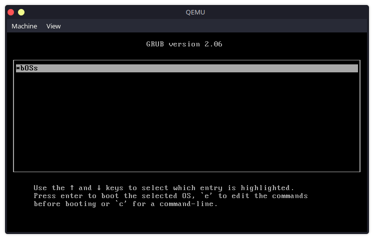
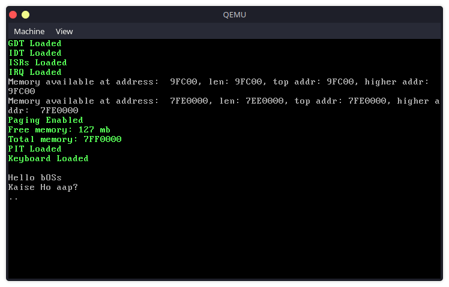
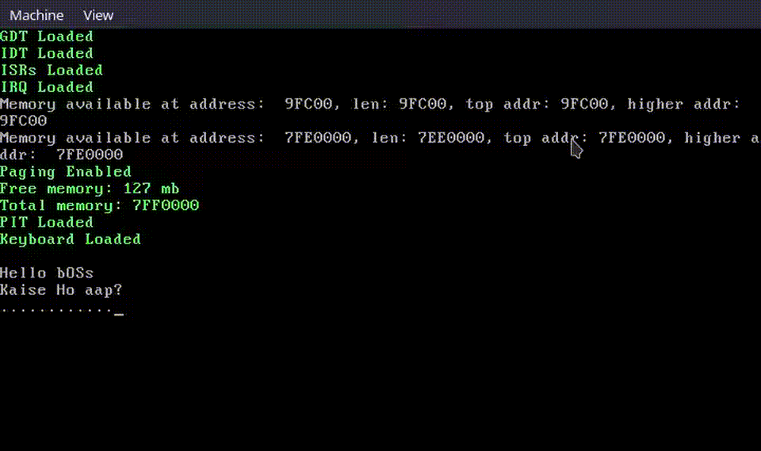

# bOSs - A Custom Bootable Operating System in C and Assembly

**bOSs** is a custom-built, bootable operating system written in **C** and **Assembly**. This OS is designed from the ground up with core functionalities like memory management, page allocation, interrupt handling, a working keyboard driver, and a Programmable Interval Timer (PIT). Targeting x86 architecture, **bOSs** is both an educational platform and a project for low-level operating system development.

---

## 🛠️ Requirements:

To build and run **bOSs**, you'll need the following tools installed:

- **i686-elf toolchain**:  
  [Setup instructions](https://wiki.osdev.org/GCC_Cross-Compiler) for cross-compiling to i686 architecture.
- **Grub2**:  
  [Download Grub2](https://www.gnu.org/software/grub/grub-download.html), the bootloader used for booting the OS.

- **Xorriso**:  
  Tool for creating ISO images from the file system, part of the GRUB build process. [Download Xorriso](https://www.gnu.org/software/xorriso/).
- **GNU Make**:  
  Required for automating the build process. [Download GNU Make](https://www.gnu.org/software/make/).

- **QEMU**:  
  An emulator to test the operating system in a virtual environment. [Download QEMU](https://www.qemu.org/download/).

---

## 🚀 Building and Running:

1. **Build the Kernel and Libraries**:  
   Run the following command to compile the kernel and standard C library:

   ```bash
   make build
   ```

2. **Create the Bootable ISO**:
   Use this command to generate the ISO file, which will be used for booting:

   ```bash
   make iso
   ```

3. **Run the OS in QEMU**:
   To launch the OS inside the QEMU virtual machine, execute:

   ```bash
   make run
   ```

4. **Clean the Build Artifacts**:
   To remove compiled files and clean the workspace:
   ```bash
   make clean
   ```

---

## 🎯 Milestones:

- ### Core Features:

  - **Standard Library**:
    Implemented essential functions for the OS's standard library, written in C.

  - **Terminal Output**:
    Basic terminal output and printing functionality for user interaction.

  - **Global Descriptor Table (GDT)**:
    Implemented GDT for memory segmentation, with part of the setup written in Assembly for low-level control.

- ### Interrupt Handling:

  - **CPU Interrupts**:
    Configured both software and hardware interrupts using C and Assembly.

  - **Hardware Interrupts**:
    Enabled interrupt handling for external devices like the keyboard using Assembly to interface with the PIC (Programmable Interrupt Controller).

- ### Peripheral Support:

  - **Timer (PIT)**:
    Integrated a Programmable Interval Timer (PIT) for task scheduling and system clock management.

  - **Keyboard Input**:
    Implemented a working keyboard driver to capture user input using interrupts, with some portions written in Assembly for precise hardware communication.

- ### Memory Management:

  - **Paging**:
    Simple non-PAE paging for memory protection and management.

  - **Page Allocator**:
    Efficient memory page allocation for kernel processes, leveraging both C and Assembly for performance.

---

## 📸 Screenshots and Media::

### Grub Menu:



### Home:



### Keyboard and Timer:



---

## 📌 Acknowledgements:

Special thanks to the OSDev community for their comprehensive resources and the open-source tools that made this project possible.

---

bOSs is an ongoing project that combines C for high-level logic and Assembly for low-level system control. It's a great platform for anyone interested in learning how operating systems interact with hardware at the lowest levels.
